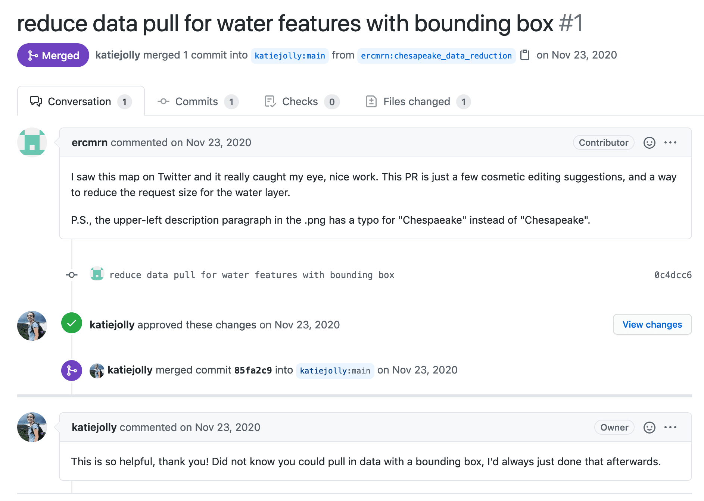

```{r setup, include=FALSE}
options(htmltools.dir.version = FALSE)
knitr::opts_chunk$set(
  fig.width=9, fig.height=3.5, fig.retina=3,
  out.width = "100%",
  cache = FALSE,
  echo = TRUE,
  message = FALSE, 
  warning = FALSE,
  fig.show = TRUE,
  hiline = TRUE
)
```

```{r xaringan-themer, include=FALSE, warning=FALSE}
library(xaringanthemer)
style_duo_accent(
  primary_color  = "#5B618A",
  secondary_color = "#F4E6A7",
  text_font_google = google_font("Lato"),
  code_font_google = google_font("Fira Mono"),
  header_font_google = google_font("Archivo", "300", "400"),
  text_font_size = 16
)
```

class: inverse center middle

# Why (and how) should we do data visualization critiques?

One thing that's been mentioned many times today is that "R users aren't designers" which I generally agree with and think is perfectly fine. That being said, I think we can take a lot of lessons from critiques in the design world! By this I mean the process by which you get feedback and in progress work. I really love posting data visualizations online (mostly on my Twitter account). I find that this is a great way to get feedback from other people. Often people have expertise in areas that are new to me or I want to learn more about. Over time I've learned some lessons from sharing my work that I think would be helpful for other people. Today I'll talk a little bit about those lessons with some examples of comments from social media. If social media isn't your thing-- that is fine! I think these lessons can also be applied to presenting in-progress work at R meetups, in work Slack, or any other forum for sharing your projects. 

---
class: split-four

.pull-left[

 
 
 <br>
 <br>
 
 
  
 ]
 
 .pull-right[
 
 <br>
 <br>
 <br>
 <br>
 <br>
 ## Some examples I'll discuss critiques for

 

 ]

These are two examples from the 30 day map challenge in November 2020. I aimed to make maps in only a few hours (time flies!) and just did as many days as I could. I think I did about 10 in the end. My suburbs map was posted in many places-- including a popular subreddit for maps-- which gave me tons of examples of helpful (and not as helpful) comments
---
class: inverse center middle

# Not all criticism is helpful or correct

<style>
.centerimg {
  display: block;
  margin-left: auto;
  margin-right: auto;
}
</style>

I think the *most important* lesson to remember is that not all criticism is helpful. If you are giving critiques for someone else, first see if they're actually interested in hearing it. And above all be kind-- even if you don't love someone else's work, give suggestions rather than exclusively criticisms. And remember that your opinion (say, what to highlight or what type of chart to use) isn't always correct (this one can be tough). 

Alright, with that let's go into some lessons I've learned via the comment section. 
  
---

# People love to find themselves and compare to others (especially when it's a map)

  

On Reddit: 

> That southeast part of Richmond that is rural is called Varina and it is exactly like this map depicts. This oddly rural area abutting the city where you can go from near downtown to the middle of a bean field in a tenth of a mile or two.

When I made this map I wasn't really sure what would come of it. Turns out (and this wasn't surprising) what clicked the most for users was finding an area familiar to them and relating their own experience. People had *so many* thoughts on what should and shouldn't be classified a certain way. And many other people had personal experiences that resonated more than I was expecting! I've learned that people will engage much more with visualizations that mean something to them.

---

# Annotations are great for guiding a reader's understanding


I quickly found that people weren't always taking away the messages that I wanted them to. One of the most common critical comments was "hey! there's no way [insert area here] should be 100% suburban! This is a mistake." To me, the legend was clear (and also made in a few minutes, so bear with me here). The labels were right-aligned, thus marking the upper limit of each category. A block with the darkest color in a category is anywhere from 80 to 100%, not exactly 100. This was very unclear to a lot of readers and more labels would have helped tremendously. Similarly, I should have noted that white areas on the map were no data. 

---

# Share your code because people may have tips you never thought to ask for



I created a public GitHub repository for all my work because that's how I save things. I was not expecting people to really look at it! I was pleasantly surprised to see a pull request show up. Someone had actually read through my code and noticed I was filtering a huge dataset *after* reading it in, making the process slower than it could have been. They opened a pull request and made the necessary edits-- I don't know when I would have learned this trick otherwise! Data visualization critiques are not limited to the design itself, code critiques are also helpful. 
---

# There are many people online with niche insights


Alex Fries on Twitter:
 > Great map! I’ve looked at the dataset you used for it before—off the top of my head, I know it’s missing the Perdido River on the AL-FL border. There’s also the Pigeon, Pine, and Granite Rivers on the eastern MN-ON border, though those are easy to miss with all the lakes there!
 
This is one of my favorite lessons/reasons for posting work online. Alex had worked with this data previously and knew there was some missing data. He kindly shared his knowledge and I made the changes. I really appreciate when people take the time to give constructive critiques. He easily could have just said something along the lines of "you're missing data" which wouldn't have gotten me much farther along. 
 
---
 
# More reading/links I've mentioned:
 
* Presentation on accessibility for data visualization by Silvia Canelón and Liz Hare https://github.com/spcanelon/csvConf2021 
 
* Helpful alt text formula from Amy Cesal https://medium.com/nightingale/writing-alt-text-for-data-visualization-2a218ef43f81
 
* Post on data visualization citiques by Alli Torban https://www.tableau.com/about/blog/2019/5/critiquing-data-visualizations-channel-empathy-and-be-productive

* Policy Viz data visualization critiques https://policyviz.com/2021/06/03/new-video-series-data-visualization-critiques/
